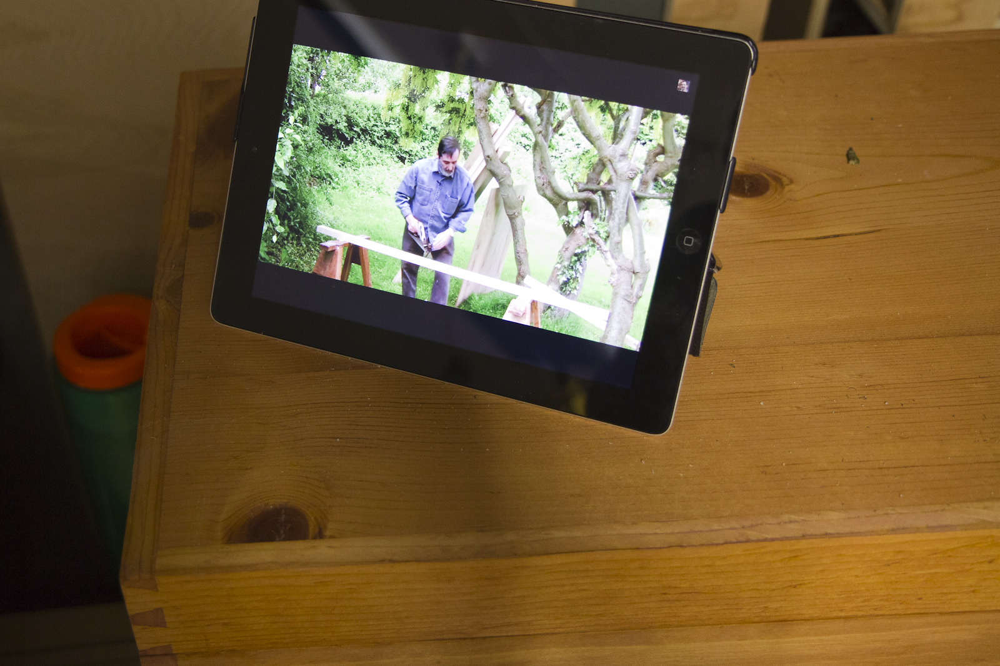
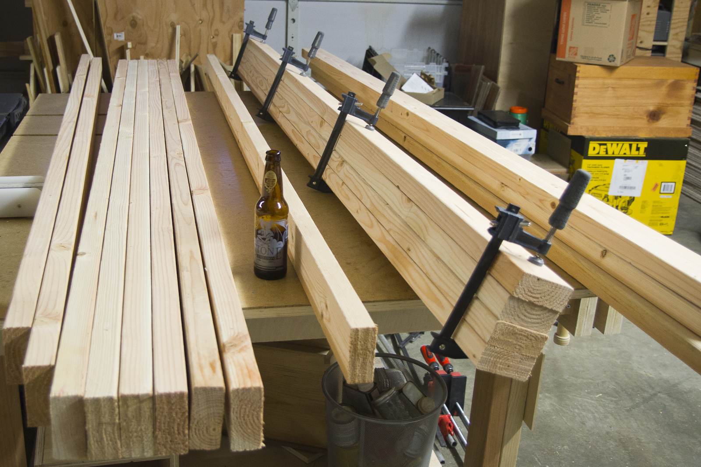
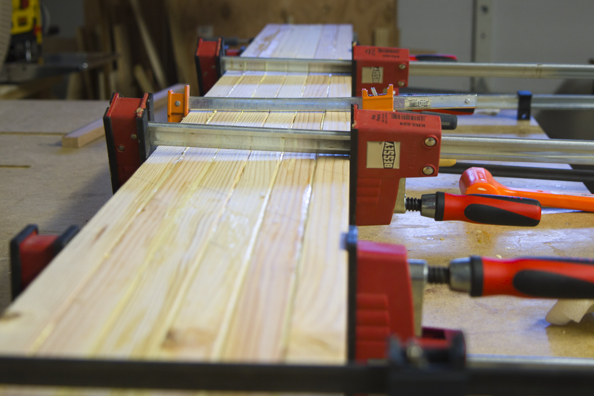
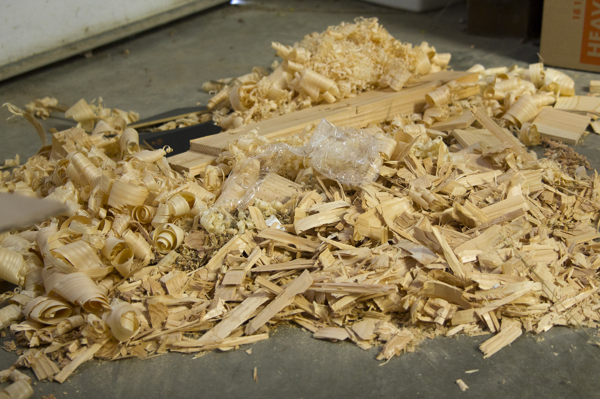
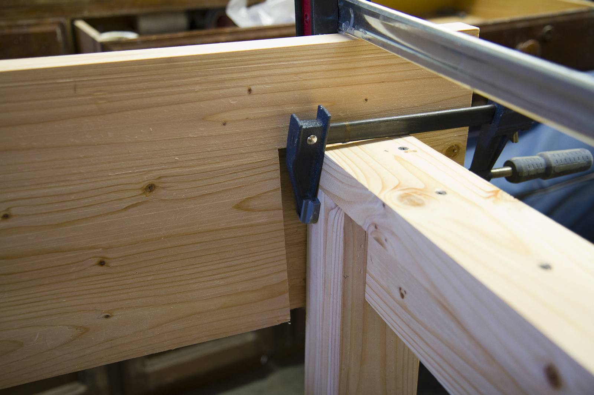
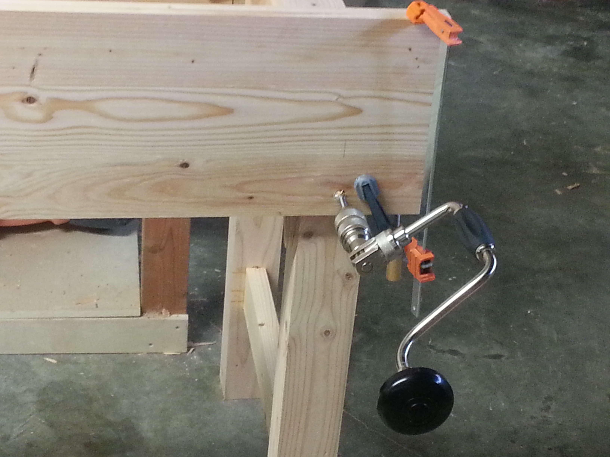
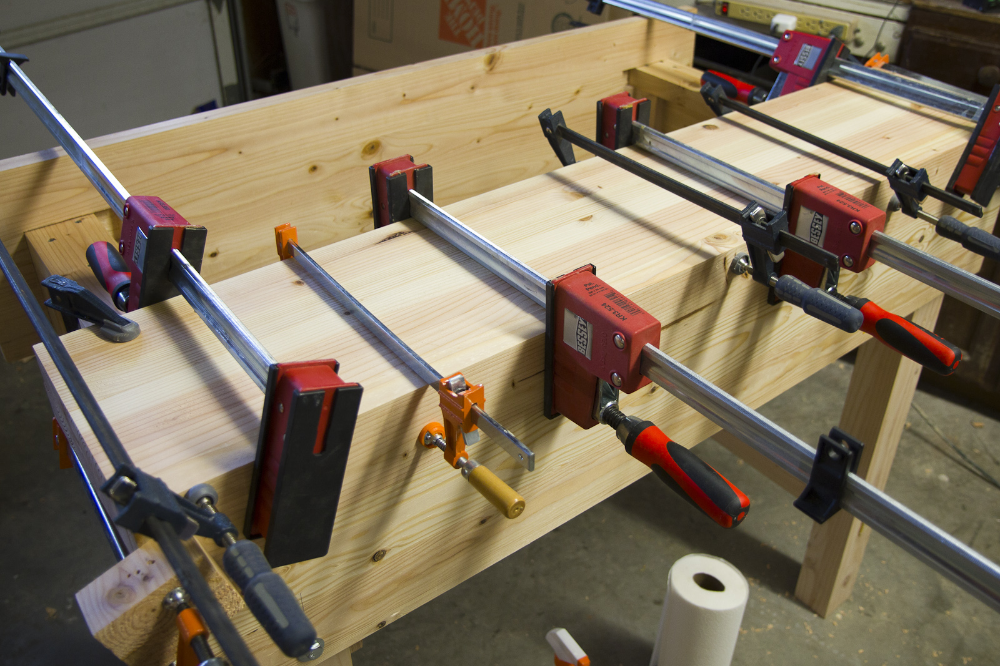
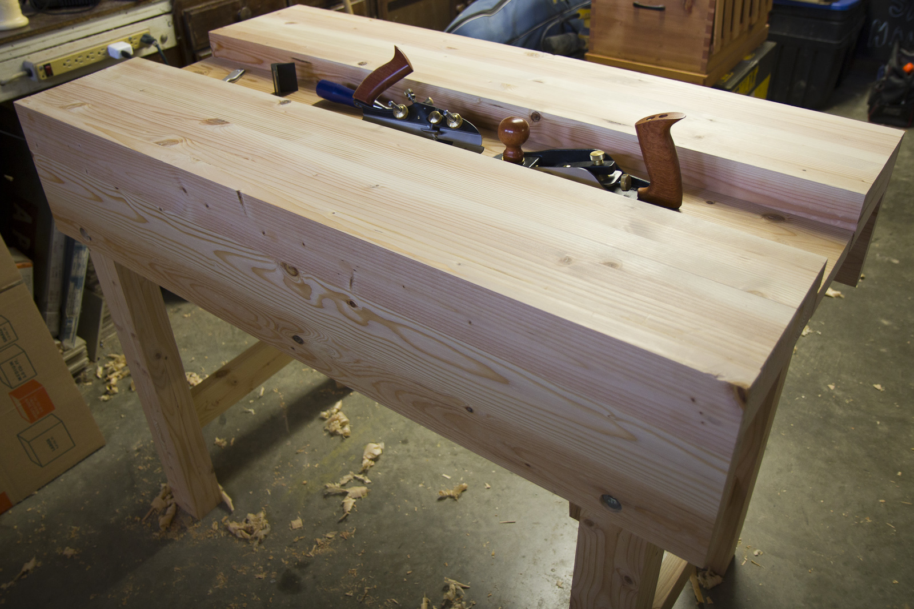

+++
title = "Bench Build"
date = 2014-04-25T00:00:00-08:00
draft = false
authors = ["admin"]
[taxonomies]
tags = ["woodworking"]
+++

After watching Paul Sellers’ build a workbench on YouTube I was convinced that
was the way to go for my first serious bench. It had everything I wanted, from
mobility and stability to inexpensive materials. It seemed like such a low risk
endeavor with so much learning potential that I just couldn’t convince myself to
go any other way. I knew that because of my upcoming move a full length bench
would be a risky commitment and so decided to go with a 4′ version.

I started at my local big box store, hunting for good boards. The only kiln
dried lumber my local store sells is 2x4x8 whitewood. I poured over them for a
while picking out the straightest and clearest boards. I knew I needed 6-8
boards with clear narrow edges for the top and 6 boards with clear faces for
aprons and the well. I did my best to find 4 other clear everywhere boards for
the legs. This part simply went OK. If I had more time I might try and do this
in multiple trips, buying boards for the top in one trip and legs in another,
for example. Even though I had access to a new pallet, I found it difficult to
find that many solid picks. I did overbuy as well, which turned out to be a good
idea.

I did all the dimensioning on this project using power tools and all of the
joinery using hand tools. I’m slowly building my hand tool arsenal and didn’t
feel prepared to work all the boards down by hand.

First, I ran all the boards through my planer, eliminating a bulk of the easing
on the edges. Next, I started gluing a few things up, including the top, then
the legs and then the well board and aprons. In the future, I would glue the top
up and then the legs and only glue the aprons/well after I had assembled the
legs. My aprons ended up slightly warped and I feel like waiting may have given
me the chance to avoid that.

I crosscut the 8 foot pieces down to 4 using a sled on my table saw. I had to
flip the top over to get all the way through and it turned out just fine. In
fact I also did this to trim the rough ends off and was surprised at my ability
to get a flush cut after flipping over.

After gluing up the legs, I cut them to length and started the mortises for the
tenons. I didn’t get any pictures of this, which may be a testament to the job
that I did on them. The first two were horrible and I quickly learned (despite
Paul saying so) that I should flip them over and mortise from both sides. When
the first mortise blew out around a knot there was a moment of panic and then a
calming clarity that comes from knowing that I could just make that the inside
face and hide the ugliness with the tenon. The others went better and I was
feeling pretty good by the end of the fourth and then I realized there were four
more. It was tough work. I did sharpen my chisel twice, but no matter how hard I
tried I couldn’t drive the chisel as deeply as I felt I should be able to.
Sometimes it would only go 1/16th in, sometimes 1/8th in. I used the same
technique Paul did, and it’s important that even if you aren’t able to make the
same kind of progress you still stick with the motions as it makes for a cleaner
mortise than if you go rouge with your own approach. For example, one time I
tried drilling some material out and didn’t feel that helped speed things at
all.

Cutting the tenons went terrifically. I used my Lee Valley Tenon saw and was
able to cut all eight extremely quick. The key here was to mark them out first
and then cut them. I find that in general if I mark and then cut and mark and
then cut it’s considerably slower than if I mark them all and then cut them all.

Fit went smoothly enough. I did some minor sanding and chiseling to get things
to fit, but I wasn’t pleased to see so many gaps. All said and done, when they
were glued up I was happy to see that they were square, but I definitely need to
work on my through mortise and tenons. It was my first attempt at doing them by
hand and I definitely learned a few things.

While the legs glued up I started on the aprons. My aprons ended up twisted a
bit but I put the worse one in the “back” and started on the housing dados. This
is another situation where I’m not sure how much to attribute my struggle to the
wood, tools or my technique. I felt like I approached the problem the same as
Paul did in the video but ended up with very uneven dado bottoms. I did make a
Poor Man’s Router and that helped, as my Lee Valley router plane wasn’t wide
enough to work comfortably.

I would estimate that the work on the major joinery on the bench took me about a
week working a few hours a day.

Next came the wedges, which were straightforward to make. I used some Red Oak I
had lying around for mine.

I used my brand new brace to drill the holes for the apron bolts. I should have
recessed these from the start so I’ve got some tricky work ahead of me, probably
involving some dowels in the existing holes to keep a forstner stable on the
workpiece.

Here’s me gluing the tops to the aprons. I was patient and did this in two steps
so I could use all my clamps for each one. I also took the time to ensure things
were as square as possible first. Whenever I would walk by the bench in this
state it was hard to not imagine it as a foosball table.

I wish I had more in progress pictures of the build. It was easy to forget,
especially when you get into the zone chopping away.

Well, here’s how she looks today:

I’ll be adding a finish of danish oil to at least the legs and possibly the
bench top. I haven’t decided yet. Also, I’ve got a vice on order from Lee Valley
that will go through the apron you can see above.
