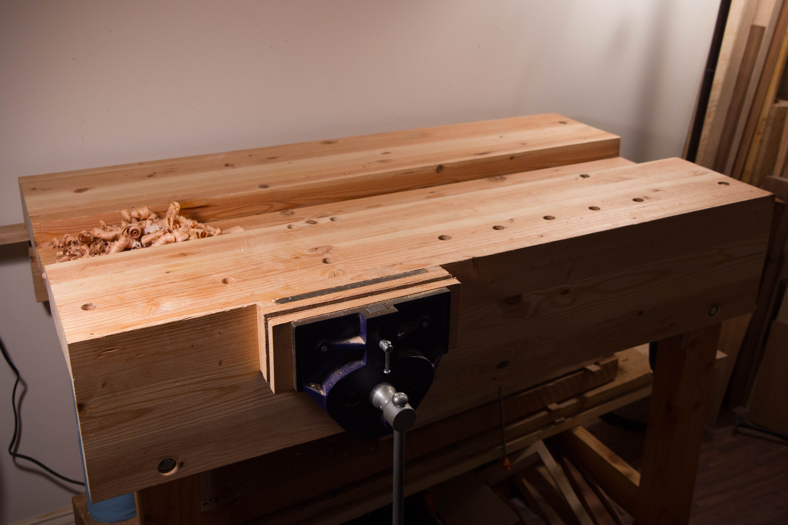

+++
title = "Bench Retrospective"
date = 2015-03-27T00:00:00-08:00
draft = false
authors = ["admin"]
[taxonomies]
tags = ["woodworking"]
+++

I’m back!

I got struck with the urge to update the blog and it seemed fitting to kick off
its resurrection with a follow up about the bench I documented before my hiatus.
I’ve been working with the bench in my apartment for several months now and have
developed a few opinions that may or may not be useful to others. Here’s how she
looks now, after ten months:

I should caveat this post with the disclaimer that while I do own several books
on benches, I have not yet read any of them because honestly I’ve found the
things that come out of the shop more interesting. It’s also hard for me to get
excited about benches because I knew for a fact that mine was temporary. So, in
light of that here’s some specific lessons that I’ve learned:

1. I should have built this bench a foot longer. Being new to hand tools I didn’t realize how much a difference the length of the bench can make. Longer is better, even if only by a foot. Especially with the vise I have which has a way of pushing the natural working area to it’s right. Also, I had thought at the time that five feet would have worked and chose to do four to keep things simple. If I were back in my garage in California I’d have an eight foot bench.
2. A few months ago I took the plunge and cut two inches off all the legs and I’ve been very happy. I even plan to do away with another inch once I get some time and energy. I don’t regret building the bench as high as I did though, as I got that experience and can now say that I’m a short bench kind of guy with some confidence.
3. My next bench won’t have a center trough at all. It is nice being able keep tools there but that’s a minor convenience compared to the times I’ve swung a hold fast out over the gap in futility. I think this is especially critical on shorter benches where your surface area is limited. Also, it affects how large certain bench accessories can be as it’s annoying having bench or paring hooks hanging out over that space. If you think you’ll love the trough, consider putting it along the back. What I think would have been perfect for this bench and my learning would have been one of those Nicholson style strips down the center.
4. I found myself wishing for a tail vise. I’ve become a huge fan of using batons to hold work, but on the shorter bench wedging batons don’t work very well for longer pieces. I suspect I would have had an easier time learning on a bench with a tail vise as I’ve had some frustrating work holding situations.
5. I’d plan the dog holes better and reconsider purchasing any metal planing stops. It took me no time at all to realize that wooden planing stops and batons are superior to metal ones. Also, I’ve never regretted 3/4″ round dog holes.
6. I wish I would have put the vise as far to the left as possible. I think it’s installed too far right by at least an inch and that, coupled with the way I find myself working to the vise’s right means I’ve got less natural working area.
7. The vise. I do get some racking, mostly when clamping down heavily with the side of the vise on a long board for a resaw with my frame saw. That’s my only complaint with the vise and so far it’s served me well for the kinds of things I’ve used it for. I can definitely imagine future projects that the vise would be less than ideal for though and that said, my next bench will have proper face and tail vises if only so that I can try them for comparison.

I’m glad that I chose to build a “throw-away” bench first as I’ve been able to
learn some useful lessons that I can bring to building its successor. I’ve also
just finished building a Knockdown Nicholson bench at my local maker space
(MakeHaven) which was a great experience that I’ll write about later. Building
and using different kinds of benches has shaped how I look at my next bench. I
have definitely accepted that I’m going to be a man of many benches. There’s a
certain freedom in accepting that one single bench can’t really fill my needs as
a woodworker over my lifetime and that the next bench I build doesn’t have to be
my last. The bench I have now is serving me well and I have a feeling I’ll learn
as much from my second bench as I have from my first. At least, I hope that’s
the case.
