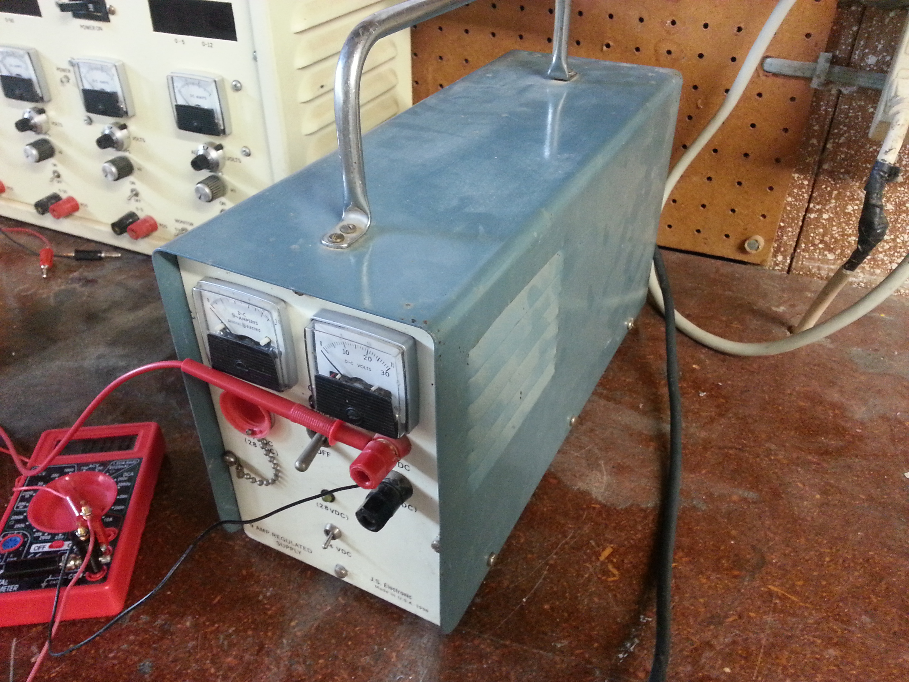
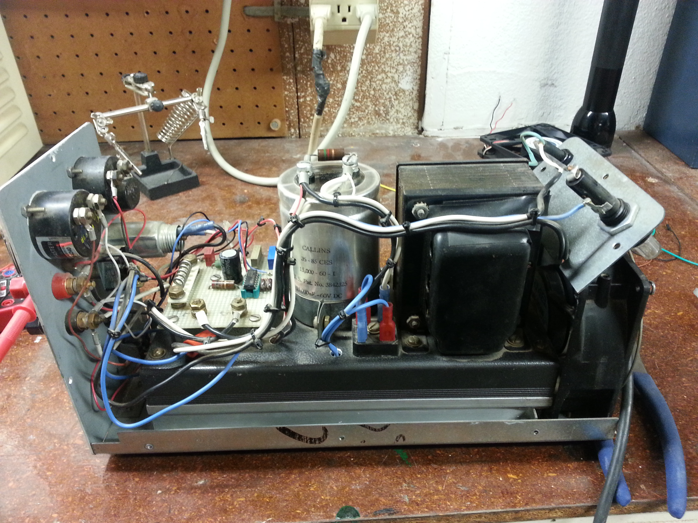
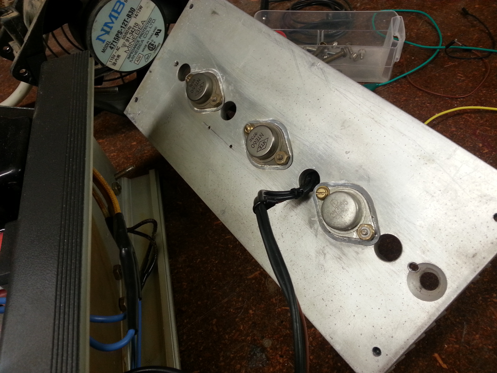
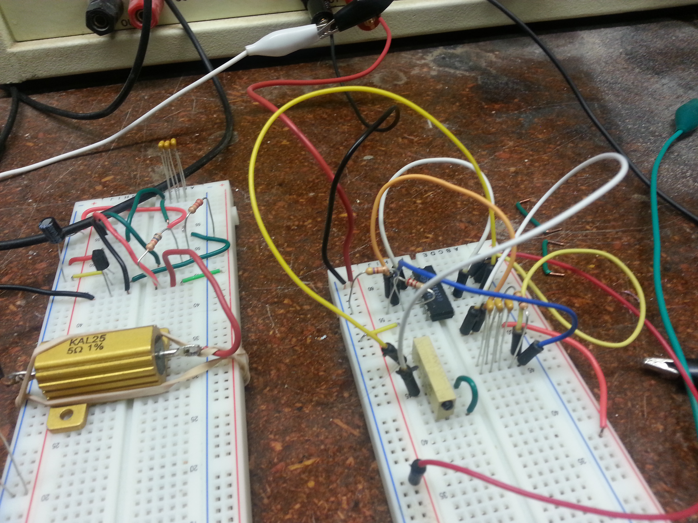
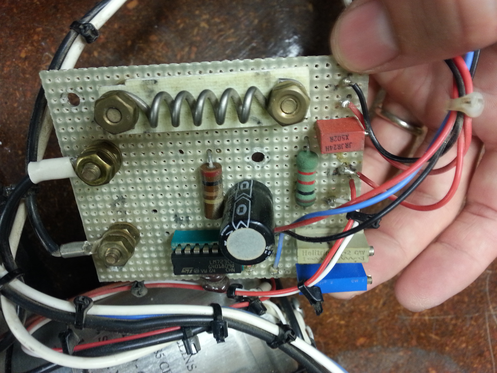
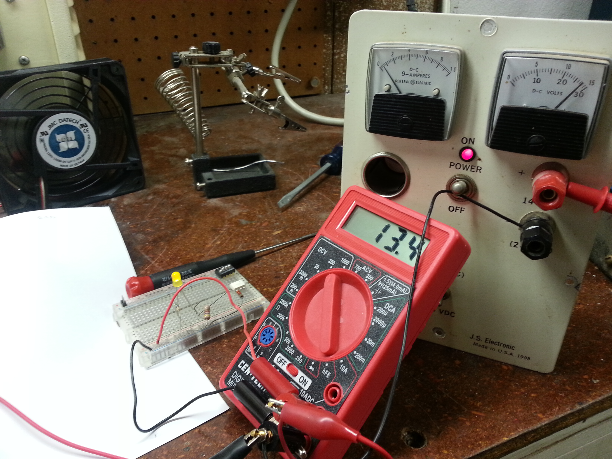

+++
title = "Grandfather's Power Supply"
date = 2013-10-21T00:00:00-08:00
draft = false
authors = ["admin"]
[taxonomies]
tags = ["electronics"]
+++

My grandfather recently passed away and I was honored to inherit some of his
electronics equipment. I could write a book about my grandfather and no blog
post could do justice to how amazing his life nor how unquenchable his love of
building and creating was. Included in what he left to me were several power
supplies, one of which wasn’t working when I got it home:

It’s got a switch for changing between 14V and 28V and there’s a label
indicating that it’s a 9A power supply he created in 1998. I decided it would be
a pretty fitting task to repair it and so set about taking the thing apart.
Here’s a picture with the casing off:

You can immediately see the transformer and rectifier as well as a very large
smoothing capacitor. Alongside that there’s a board with the voltage regulation
circuitry with the current sense resistor and trimpots for tuning the voltage to
14V and 28V. Along the bottom is a large heatsink where the power transistors
are, which look like this:

I suspected these or the capacitor first. I don’t have much experience working
on power supplies but figured they were the most likely culprits to fail. After
some testing though, I started to suspect the voltage regular chip itself. A
quick google for the chip got me the data sheet  and I was able to toss together
a quick test circuit using parts I knew to be good.

This turned out to be the right track as I wasn’t able to get things working, so
I was hopeful when I found a modern replacement for the chip for $0.60 and
ordered one up. With that on the board and everything reattached the power
supply was working again.

This was only one of the power supplies he left behind and I’m hoping to take
some pictures of the others and their insides for a future post.
